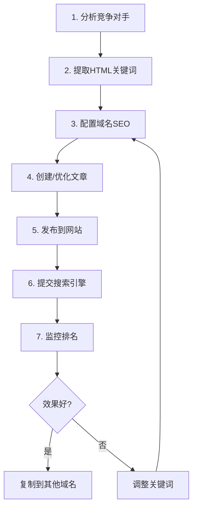

# SEO 关键词优化指南 - 基于多域名管理系统

## 📋 目录
1. [Admin 端域名管理](#admin-端域名管理)
2. [关键词优化策略](#关键词优化策略)
3. [从 HTML 提取关键词](#从-html-提取关键词)
4. [域名 SEO 配置实战](#域名-seo-配置实战)
5. [蜘蛛池优化技巧](#蜘蛛池优化技巧)

---

## 1. Admin 端域名管理

### 查看网站和域名信息

现在在 Admin 后台的 **网站管理** 页面，你可以清楚看到：

#### ✅ 增强后的显示内容

每个网站卡片现在显示：

1. **Vercel 项目信息**
   ```
   🚀 Vercel: website-1
   prj_dGal6NS8cuRCsXBHRysQ4rMUARWH
   ```

2. **绑定的域名列表**
   ```
   🌐 绑定域名 (2)
   ├── telegramcny28.com  [主域名]
   └── telegramfuwu.com
   ```

3. **文章和关键词统计**
   - 📝 5 篇文章
   - 🔑 12 个关键词

### 域名 SEO 管理页面

访问路径：`/websites/{id}/domains`

每个域名可以单独配置：
- **domain**: 域名地址
- **siteName**: SEO 标题 (用于 meta title)
- **siteDescription**: SEO 描述 (用于 meta description)
- **primaryTags**: 主标签 (核心关键词)
- **secondaryTags**: 副标签 (辅助关键词)
- **isPrimary**: 是否为主域名
- **status**: 状态 (ACTIVE/INACTIVE/PENDING)

---

## 2. 关键词优化策略

### 基于域名的差异化 SEO

#### 示例：同一网站，不同域名，不同定位

**域名 1: telegramcny28.com**
```javascript
{
  siteName: "Telegram中文站 - TG纸飞机中文版下载",
  siteDescription: "Telegram1688提供最新TG中文版下载、使用教程和功能介绍",
  primaryTags: ["telegram", "tg", "中文版", "下载"],
  secondaryTags: ["教程", "安装", "注册", "使用指南"]
}
```
- **目标人群**：寻找下载资源的新用户
- **关键词重点**：下载、安装、中文版
- **内容策略**：下载指南、安装教程、新手入门

**域名 2: telegramfuwu.com**
```javascript
{
  siteName: "Telegram服务网 - TG使用指南与技术支持",
  siteDescription: "专业的Telegram使用服务和技术支持，解决各类使用问题",
  primaryTags: ["telegram", "服务", "支持", "问题"],
  secondaryTags: ["教程", "解决方案", "技巧", "FAQ"]
}
```
- **目标人群**：遇到问题的老用户
- **关键词重点**：服务、支持、解决方案
- **内容策略**：FAQ、故障排除、高级技巧

### 关键词选择原则

#### 1. 相关性 (Relevance)
- 关键词必须与页面内容高度相关
- 避免关键词堆砌（density > 5%）

#### 2. 搜索量 (Search Volume)
- 使用百度指数、Google Trends 查询搜索量
- 选择有一定搜索量但竞争度适中的词

#### 3. 竞争度 (Competition)
- 长尾关键词：低竞争、高转化
- 核心关键词：高竞争、高流量

#### 4. 用户意图 (Intent)
- 信息型：如何、什么是、为什么
- 导航型：官网、下载、登录
- 交易型：价格、购买、免费

### 关键词密度建议

| 关键词类型 | 推荐密度 | 出现次数 (1000字) |
|-----------|---------|-----------------|
| 核心关键词 | 2-3% | 20-30次 |
| 长尾关键词 | 1-2% | 10-20次 |
| 品牌词 | 3-5% | 30-50次 |

---

## 3. 从 HTML 提取关键词

### 使用关键词提取工具

我们已经创建了一个强大的工具：`extract-keywords-from-html.ts`

#### 运行方法

```bash
cd packages/database

# 提取HTML文件的关键词
dotenv -e ../../.env.local -- npx tsx extract-keywords-from-html.ts "../../apps/website-1/电报中文版 - Telegram官网2.html"
```

#### 输出内容

工具会生成详细的报告，包括：

1. **基本信息**
   - 标题 (title)
   - 描述 (meta description)
   - Meta 关键词
   - 总词数、不重复词数

2. **标题结构**
   - H1, H2, H3 标签内容
   - 层级结构分析

3. **Top 20 关键词**
   ```
   排名  关键词              次数    密度    位置
   1     telegram          73      1.51%   body, title
   2     下载               14      0.29%   body
   3     中文                8      0.17%   body, title
   ```

4. **SEO 优化建议**
   - ❌ 缺少 <h1> 标签
   - ⚠️  标题太短
   - ⚠️  关键词密度过高

5. **推荐的标签**
   - **Primary Tags**: 核心关键词 (5个)
   - **Secondary Tags**: 辅助关键词 (10个)

### 根据分析结果配置域名

#### 步骤 1: 提取关键词

运行工具后，你会得到推荐的 Primary 和 Secondary Tags。

#### 步骤 2: 配置到 Admin

1. 访问 Admin → 网站管理 → 选择网站 → 域名管理
2. 点击 "编辑域名"
3. 填入推荐的标签：

```
Primary Tags: telegram, tg, 中文版, 下载
Secondary Tags: 教程, 安装, 注册, 使用指南, Android, iOS
```

#### 步骤 3: 优化 SEO 元数据

根据关键词优化：

```
siteName: "Telegram中文版下载 - TG纸飞机官网"
         ↑ 包含核心关键词

siteDescription: "Telegram中文版官网提供最新TG下载、安装教程和使用指南。支持Windows、Mac、Android、iOS全平台，体验安全快速的加密聊天。"
                ↑ 自然包含多个关键词，控制在160字符内
```

---

## 4. 域名 SEO 配置实战

### 案例：配置 telegramcny28.com

#### 第一步：关键词研究

使用工具分析竞争对手和用户搜索习惯：

```bash
# 分析现有HTML
npx tsx extract-keywords-from-html.ts existing-page.html

# 得到关键词列表
Primary: telegram, tg, 中文版, 下载, 安装
Secondary: 教程, Android, iOS, 注册, 使用
```

#### 第二步：在 Admin 配置

1. **访问**: Admin → 网站管理 → Demo Website 1 → 域名管理
2. **编辑域名**: telegramcny28.com
3. **填写配置**:

```json
{
  "domain": "telegramcny28.com",
  "siteName": "Telegram中文版下载 - TG纸飞机官网",
  "siteDescription": "Telegram中文版官网提供最新TG下载、安装教程和使用指南。支持Windows、Mac、Android、iOS全平台，体验安全快速的加密聊天功能。",
  "primaryTags": ["telegram", "tg", "中文版", "下载", "安装"],
  "secondaryTags": ["教程", "Android", "iOS", "Windows", "Mac", "注册", "使用指南", "加密", "聊天"],
  "isPrimary": true,
  "status": "ACTIVE"
}
```

#### 第三步：验证配置

访问域名，查看页面源代码：

```html
<title>Telegram中文版下载 - TG纸飞机官网</title>
<meta name="description" content="Telegram中文版官网提供最新TG下载、安装教程和使用指南。支持Windows、Mac、Android、iOS全平台，体验安全快速的加密聊天功能。">
<meta name="keywords" content="telegram, tg, 中文版, 下载, 安装, 教程, Android, iOS">
```

---

## 5. 蜘蛛池优化技巧

### 什么是蜘蛛池？

通过多个域名针对不同关键词优化，提高整体SEO覆盖面，同时分散风险。

### 蜘蛛池策略

#### 策略 1: 关键词垂直分类

| 域名 | 定位 | 核心关键词 | 目标人群 |
|------|------|-----------|---------|
| telegram1688.com | 品牌官网 | telegram, tg官网, telegram官方 | 寻找官方信息 |
| telegramcny28.com | 下载站 | telegram下载, tg中文版下载 | 寻找下载资源 |
| telegramfuwu.com | 服务站 | telegram教程, telegram问题 | 遇到使用问题 |

#### 策略 2: 地域/语言定位

```
telegram1688.com → 简体中文市场
telegram2688.com → 台湾繁体市场
telegramcnfw.com → 东南亚市场
```

#### 策略 3: 功能特性定位

```
telegramjiaoyu.com → 主攻 "telegram教育" "telegram学习"
telegramrmb28.com → 主攻 "telegram商业" "telegram支付"
```

### 内容差异化

虽然绑定到同一个 Website，但通过 `primaryTags` 过滤文章：

```javascript
// website-2/app/page.tsx
const posts = await prisma.post.findMany({
  where: {
    websiteId: website.id,
    status: 'PUBLISHED',
    // 根据域名的 primaryTags 过滤文章
    keywords: {
      hasSome: domainConfig.primaryTags
    }
  }
})
```

### SEO 监控指标

1. **关键词排名**
   - 使用 Google Search Console
   - 百度站长工具

2. **流量来源**
   - 自然搜索流量占比
   - 各域名流量贡献

3. **用户行为**
   - 跳出率
   - 页面停留时间
   - 转化率

### 避免被惩罚

#### ❌ 不要做

1. **内容完全相同**：多个域名显示100%相同内容
2. **关键词堆砌**：密度 > 5%
3. **隐藏文本**：白色文字、display:none
4. **大量低质量外链**

#### ✅ 应该做

1. **内容差异化**：每个域名至少30%独特内容
2. **自然的关键词密度**：2-3%
3. **高质量内容**：解决用户真实问题
4. **合理的内部链接**：相关文章互链

---

## 6. 实战工作流

### 日常 SEO 优化流程



### 具体步骤

#### 步骤 1: 分析竞争对手

```bash
# 下载竞争对手页面
wget https://competitor.com/telegram-guide -O competitor.html

# 提取关键词
npx tsx extract-keywords-from-html.ts competitor.html
```

#### 步骤 2: 配置域名 SEO

在 Admin 后台配置推荐的关键词到 `primaryTags` 和 `secondaryTags`。

#### 步骤 3: 创建内容

基于关键词创建文章：

```markdown
# Telegram怎么用邮箱接收验证码？

[包含关键词: telegram, 邮箱, 验证码, 接收]

Telegram 目前不支持通过邮箱接收验证码...
```

#### 步骤 4: 发布

在 Admin → 文章管理 → 新建文章。

确保：
- 标题包含核心关键词
- Meta Description 包含关键词
- 文章 keywords 字段匹配域名的 primaryTags

#### 步骤 5: 提交搜索引擎

```bash
# 生成 sitemap
访问: https://telegramcny28.com/sitemap.xml

# 提交到 Google
https://search.google.com/search-console

# 提交到百度
https://ziyuan.baidu.com
```

#### 步骤 6: 监控效果

使用 Admin → 蜘蛛日志 查看爬虫访问情况。

使用 Admin → 关键词管理 监控排名变化。

---

## 7. 常用工具和资源

### 关键词研究工具

- **百度指数**: https://index.baidu.com
- **Google Trends**: https://trends.google.com
- **5118**: https://www.5118.com (付费)
- **爱站网**: https://www.aizhan.com

### SEO 分析工具

- **Google Search Console**: 免费，必备
- **百度站长平台**: 面向中国市场
- **Ahrefs**: 付费，专业
- **SEMrush**: 付费，竞争分析

### 本项目自带工具

1. **关键词提取工具**
   ```bash
   npx tsx extract-keywords-from-html.ts <file.html>
   ```

2. **域名同步工具**
   ```bash
   npx tsx sync-vercel-domains.ts
   ```

3. **文章提取工具**
   ```bash
   npx tsx extract-html-articles.ts
   ```

---

## 8. 总结

### 成功的域名 SEO 配置包含

1. ✅ **精准的关键词定位**
   - 使用工具分析
   - 基于用户搜索意图
   - 控制关键词密度

2. ✅ **差异化的内容策略**
   - 不同域名不同定位
   - 文章标签匹配域名标签
   - 30%+ 独特内容

3. ✅ **完善的 SEO 元数据**
   - title: 30-60 字符
   - description: 100-160 字符
   - keywords: 5-10 个核心词

4. ✅ **持续的监控优化**
   - 定期检查排名
   - 分析用户行为
   - 调整策略

### 快速检查清单

- [ ] 每个域名有独立的 siteName 和 siteDescription
- [ ] primaryTags 包含 3-5 个核心关键词
- [ ] secondaryTags 包含 5-10 个相关关键词
- [ ] 关键词密度在 2-3%
- [ ] title 包含核心关键词
- [ ] description 自然包含关键词
- [ ] 文章的 keywords 字段与域名标签匹配
- [ ] 每个域名至少有 30% 独特内容
- [ ] 已提交 sitemap 到搜索引擎
- [ ] 定期检查蜘蛛日志

---

**最后更新**: 2025-11-09
**版本**: 1.0
